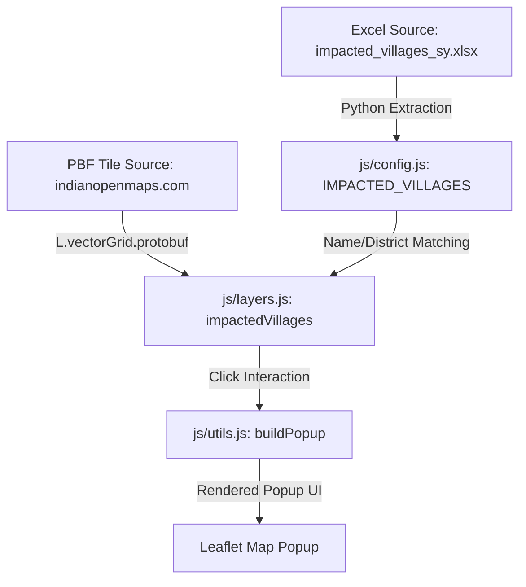

# Project Flow: CG Mining Map

This document outlines the architecture, UI flow, and data flow of the Leaflet-based GIS application for visualizing mining leases and forest data in Chhattisgarh.

---

## 🏗 Architecture Overview

The application is structured as a client-side only static web application using Leaflet.js, following a strict multi-file Vanilla JS design:

*   **`index.html`**: Entry point. Contains the DOM layout, including the Leaflet map container (`#map`) and the interactive overlay Legend UI.
*   **`css/styles.css`**: Central stylesheet. Houses all UI styling, including layout styles, control overlays, premium map UI elements, and a dedicated mobile overrides section at the bottom (`@media (max-width: 768px)`).
*   **`js/config.js`**: Application configuration and state. Stores the active layers state (`activeState`), layer metadata formatting (`LAYER_META`), and the hardcoded `IMPACTED_VILLAGES` metadata array (populated from `tests/impacted_villages_sy.xlsx`).
*   **`js/map-init.js`**: Leaflet map initialization, configuring the base maps (Google Satellite, Google Hybrid, OpenStreetMap, etc.) and zoom parameters.
*   **`js/layers.js`**: Map layer definitions. Loads and sets up layer configurations for WMS, Vector Grid PBF Tiles (like the Impacted Villages layer), GeoJSON, and KML files.
*   **`js/ui.js`**: Handlers for UI interactions (Legend checkboxes/toggles, coordinate mouse displays, search functionality, and zooming to specific layers).
*   **`js/utils.js`**: Helper functions, including the centralized popup builder `buildPopup` which renders consistent metadata tables inside Leaflet popups.

---

## 🔄 Data Flow

The data flow within the application proceeds as follows:

1.  **Metadata Injection**: Village demographic and land metadata is imported from the Excel sheet into the `IMPACTED_VILLAGES` list in `js/config.js`.
2.  **Vector Rendering**: The `impactedVillages` layer pulls vector tiles (`PBF`) from the tile source.
3.  **Client-Side Matching**: For each rendered village feature, the script compares uppercase `v_name` and `d_name` against the entries in `IMPACTED_VILLAGES`.
4.  **Dynamic Styling**:
    *   Villages matched with `remarks === 'To be displaced partially'` are styled with a **warm terracotta orange fill** (`#e67e22`).
    *   Villages matched with `remarks === 'Population not affected'` are styled with a **soft golden yellow fill** (`#ffd255`).
    *   All other project-impacted (fully displaced) villages are styled with a **deep crimson fill** (`#b33939`).
5.  **Popup Details**: When a user clicks a village on the map, the event handler looks up the corresponding metadata in `IMPACTED_VILLAGES` and feeds it into `buildPopup()` to render detailed properties (Population, Land breakdown, Status, Bank location) dynamically.

---

## 📱 UI Flow

1.  **Layer Toggle**: The user interacts with the sidebar/bottom-sheet legend. Toggling a checkbox triggers `toggleLayer('layerKey')` in `js/ui.js`, adding or removing the layer from the Leaflet map.
2.  **Zoom-To-Layer**: Clicking the zoom icon on any legend item triggers `zoomToLayer(...)` to focus the map viewport directly on that feature's bounding box.
3.  **Map Click Interactivity**: Clicking on an active vector feature resolves the correct layer properties, queries the matching metadata, and displays an information popup with styled badges and data tables.
4.  **Responsive Layout**: On desktop screens, the Legend is docked as a sidebar. On mobile screens (width ≤ 768px), it switches to a touch-optimized bottom-sheet drawer with 44x44px target buttons.
