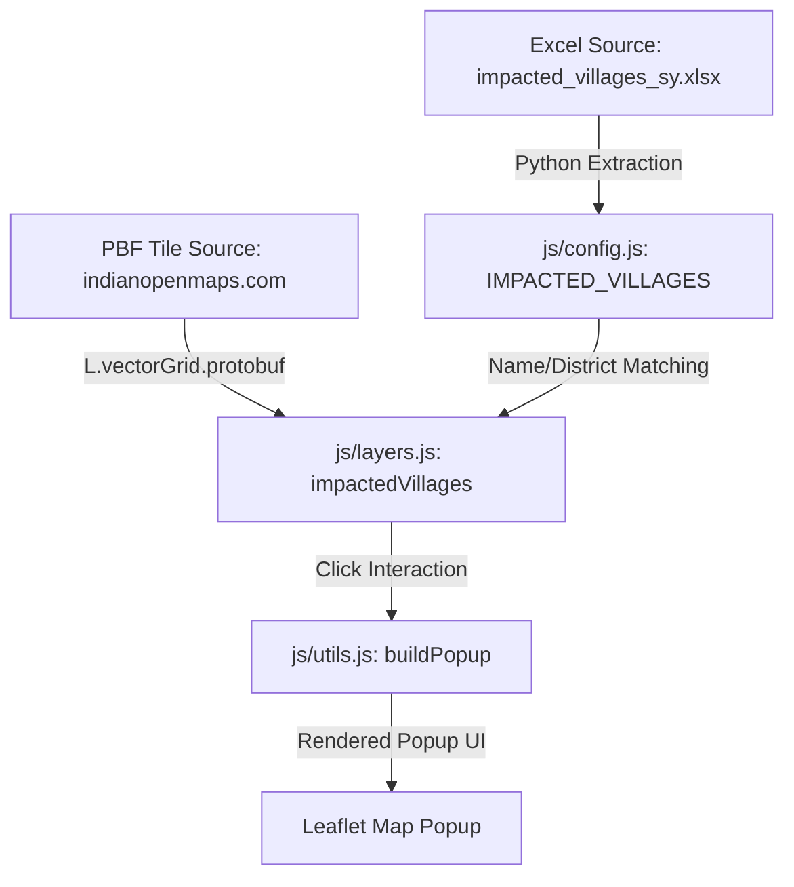

# Project Flow: CG Mining Map

This document outlines the architecture, UI flow, and data flow of the Leaflet-based GIS application for visualizing mining leases and forest data in Chhattisgarh.

---

## 🏗 Architecture Overview

The application is structured as a client-side only static web application using Leaflet.js, following a strict multi-file Vanilla JS design:

*   **`index.html`**: Entry point. Contains the DOM layout, including the Leaflet map container (`#map`) and the interactive overlay Legend UI.
*   **`css/styles.css`**: Central stylesheet. Houses all UI styling, including layout styles, control overlays, premium map UI elements, and a dedicated mobile overrides section at the bottom (`@media (max-width: 768px)`).
*   **`js/config.js`**: Application configuration and state. Stores the active layers state (`activeState`), layer metadata formatting (`LAYER_META`), and the hardcoded `IMPACTED_VILLAGES` metadata array (populated from `tests/impacted_villages_sy.xlsx`).
*   **`js/map-init.js`**: Leaflet map initialization, configuring the base maps (Google Satellite, Google Hybrid, OpenStreetMap, etc.) and zoom parameters.
*   **`js/layers.js`**: Map layer definitions. Loads and sets up layer configurations for WMS, Vector Grid PBF Tiles (like the Impacted Villages layer), GeoJSON, and KML files (such as Deposit 4 and Deposit 5).
*   **`js/ui.js`**: Handlers for UI interactions (Legend checkboxes/toggles, coordinate mouse displays, search functionality, and zooming to specific layers).
*   **`js/utils.js`**: Helper functions, including the centralized popup builder `buildPopup` which renders consistent metadata tables inside Leaflet popups.
*   **`js/clan-gods.js`**: Implements the Clan Gods layer, featuring dynamic phratry filtering, zoom-dependent details, collision-avoiding HTML labels (via `rbush`), and dynamic pixel-to-LatLng marker offsets.

---

## 🔄 Data Flow

The data flow within the application proceeds as follows:

1.  **Metadata Injection**: Village demographic and land metadata is imported from the Excel sheet into the `IMPACTED_VILLAGES` list in `js/config.js`.
2.  **Vector Rendering**: The `impactedVillages` layer pulls vector tiles (`PBF`) from the tile source.
3.  **Client-Side Matching**: For each rendered village feature, the script compares uppercase `v_name` and `d_name` against the entries in `IMPACTED_VILLAGES`.
4.  **Dynamic Styling**:
    *   Villages matched with `remarks === 'To be displaced partially'` are styled with a **warm terracotta orange fill** (`#e67e22`).
    *   Villages matched with `remarks === 'Population not affected'` are styled with a **soft golden yellow fill** (`#ffd255`).
    *   All other project-impacted (fully displaced) villages are styled with a **deep crimson fill** (`#b33939`).
5.  **Popup Details**: When a user clicks a village on the map, the event handler looks up the corresponding metadata in `IMPACTED_VILLAGES` and feeds it into `buildPopup()` to render detailed properties (Population, Land breakdown, Status, Bank location) dynamically.

---

## 📱 UI Flow

1.  **Layer Toggle**: The user interacts with the sidebar/bottom-sheet legend. Toggling a checkbox triggers `toggleLayer('layerKey')` in `js/ui.js`, adding or removing the layer from the Leaflet map.
2.  **Zoom-To-Layer**: Clicking the zoom icon on any legend item triggers `zoomToLayer(...)` to focus the map viewport directly on that feature's bounding box.
3.  **Map Click Interactivity**: Clicking on an active vector feature resolves the correct layer properties, queries the matching metadata, and displays an information popup with styled badges and data tables.
4.  **Responsive Layout**: On desktop screens, the Legend is docked as a sidebar. On mobile screens (width ≤ 768px), it switches to a touch-optimized bottom-sheet drawer with 44x44px target buttons.

---

## 🔱 Clan Gods Layer & Decluttering Strategy

### 🔄 Data Flow
The Clan Gods layer aggregates data from three asynchronous local files:
1. `data/gods_and_goddesses/clan_gods.json`: Holds primary pens, clans, phratries, village relationships, and subordinate pen IDs.
2. `data/gods_and_goddesses/village_centroids.json`: Provides lat/lng coordinates for village centroids.
3. `data/gods_and_goddesses/vcode_bhuvan_name.json`: Maps standard village codes to census names.

### 🗺 Decluttering and Collision Avoidance
To prevent overlapping village labels, circle markers, and pen names, the layer uses a multi-faceted rendering strategy:

1. **Zoom-Dependent Level of Detail (LoD)**
   * **Zoom < 12**: Detailed pen circle markers, pen/sub-pen labels, and relation lines are hidden. Only Bhuvan village polygons (colored by phratry) and village name labels are displayed.
   * **Zoom >= 12**: Circle markers, pen labels, leader lines, and relation lines are fully rendered.

2. **Dynamic Pixel-Based Marker Offsets**
   * Multiple pens at the same village centroid are arranged in an offset circle. The offset is calculated dynamically in screen pixel space (e.g., `16.5px` radius) and projected back to geographic coordinates on map move/zoom events. This keeps markers at a constant visual spacing at any zoom level.

3. **Collision Detection via Spatial Indexing (`rbush`)**
   * When drawing labels, the bounding box of each active circle marker is seeded into a 2D spatial index (`rbush`).
   * Label placements are tried in 8 symmetric directions (Above, Below, Right, Left, and diagonals) at expanding margins (`4px`, `16px`, `28px`, `40px`) centered around their anchors.
   * Village name labels have the highest priority and are placed first. Main pen labels have medium priority, and sub-pen labels have lowest priority.
   * Labels that collide with markers or previously placed labels are strictly hidden (rather than forced to render on top of each other), automatically reappearing as the user zooms in.

---

## 🪖 OSM Landuse Military Layer

### 🔄 Data Flow & Extraction
1. **Query Definition**: The layer maps military areas using the Overpass Turbo query `nwr["landuse"="military"]` inside the Chhattisgarh bounding box.
2. **Local Caching**: The data is fetched and processed via python scripts. The raw JSON query dump is stored under `data/Extra Data/osm_landuse_military_raw.json` and the processed GeoJSON dataset containing centroids is saved to `data/police_military_camps/osm_landuse_military.geojson`.
3. **Clustering & View Toggle**:
   * The layer renders individual point markers (`geoLayerOsmMilitary`) showing independent dot markers with steel blue styling by default.
   * A view toggle button in the legend allows users to switch to a clustered layout (`osmMilitaryCluster`) to group locations, changing the button styling to active (green).

