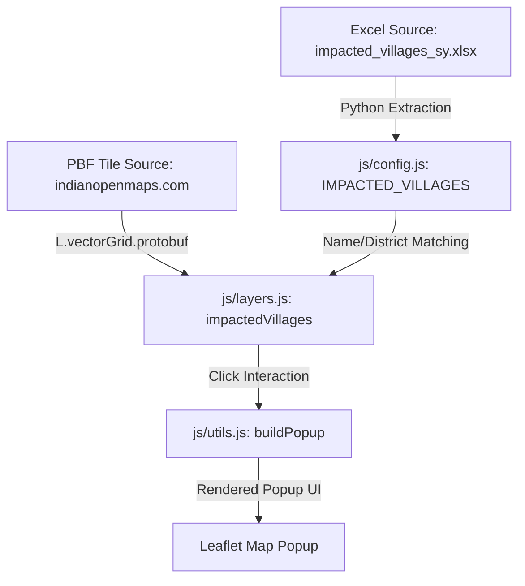

# Project Flow: CG Mining Map

This document outlines the architecture, UI flow, and data flow of the Leaflet-based GIS application for visualizing mining leases and forest data in Chhattisgarh.

---

## 🏗 Architecture Overview

The application is structured as a client-side only static web application using Leaflet.js, following a strict multi-file Vanilla JS design:

*   **`index.html`**: Entry point. Contains the DOM layout, including the Leaflet map container (`#map`) and the empty placeholder for the dynamically-rendered Legend UI.
*   **`css/styles.css`**: Central stylesheet. Houses all UI styling, including layout styles, control overlays, premium map UI elements, and a dedicated mobile overrides section at the bottom (`@media (max-width: 768px)`).
*   **`js/config.js`**: Application configuration and state. Stores the active layers state (`activeState`), layer metadata formatting (`LAYER_META`), the hardcoded `IMPACTED_VILLAGES` metadata array, and the `LEGEND_CONFIG` layout definition used for dynamic legend rendering.
*   **`js/map-init.js`**: Leaflet map initialization, configuring map boundaries, custom panes, scale overlay, and zoom parameters.
*   **`js/layers.js`**: Map layer definitions. Loads and sets up layer configurations for WMS, Vector Grid PBF Tiles (like the Impacted Villages layer), GeoJSON, and KML files (such as Deposit 4, Deposit 5, and the PEKB group containing both Parsa East & Kanta Basan and Parsa Coal Block).
*   **`js/ui.js`**: Dynamic legend builder (`renderLegend`), base map options configuration (including Google Satellite, ESRI Satellite, OpenStreetMap, OpenTopoMap, Stadia Stamen Terrain, CartoDB Dark Matter, and Survey of India Topo with zoom auto-scaling), and handlers for UI interactions (toggles, mouse coordinate tracking, search, and layer zooming).
*   **`js/utils.js`**: Helper functions, including the centralized popup builder `buildPopup` which renders consistent metadata tables inside Leaflet popups.
*   **`js/clan-gods.js`**: Implements the Clan Gods layer, featuring dynamic phratry filtering, zoom-dependent details, collision-avoiding HTML labels (via `rbush`), and dynamic pixel-to-LatLng marker offsets.

---

## 🔄 Data Flow

The data flow within the application proceeds as follows:

1.  **Metadata Injection**: Village demographic and land metadata is imported from the Excel sheet into the `IMPACTED_VILLAGES` list in `js/config.js`.
2.  **Vector Rendering**: The `impactedVillages` layer pulls vector tiles (`PBF`) from the tile source.
3.  **Client-Side Matching**: For each rendered village feature, the script compares uppercase `v_name` and `d_name` against the entries in `IMPACTED_VILLAGES`.
4.  **Dynamic Styling**:
    *   Villages matched with `remarks === 'To be displaced partially'` are styled with a **warm terracotta orange fill** (`#e67e22`).
    *   Villages matched with `remarks === 'Population not affected'` are styled with a **soft golden yellow fill** (`#ffd255`).
    *   All other project-impacted (fully displaced) villages are styled with a **deep crimson fill** (`#b33939`).
5.  **Popup Details**: When a user clicks a village on the map, the event handler looks up the corresponding metadata in `IMPACTED_VILLAGES` and feeds it into `buildPopup()` to render detailed properties (Population, Land breakdown, Status, Bank location) dynamically.

---

## 📱 UI Flow

1.  **Layer Toggle**: The user interacts with the sidebar/bottom-sheet legend. Toggling a checkbox triggers `toggleLayer('layerKey')` in `js/ui.js`, adding or removing the layer from the Leaflet map.
2.  **Clear All Layers**: Clicking the **Clear All** button in the legend header calls `clearAllLayers(event)`, setting all overlays to inactive and synchronizing the map and legend checkboxes.
3.  **Zoom-To-Layer**: Clicking the zoom icon on any legend item triggers `zoomToLayer(...)` to focus the map viewport directly on that feature's bounding box.
4.  **Map Click Interactivity**: Clicking on an active vector feature resolves the correct layer properties, queries the matching metadata, and displays an information popup with styled badges and data tables.
5. **Responsive Layout & Screenshot Mode**: On desktop screens, the Legend is docked as a sidebar. On mobile screens (width ≤ 768px), it switches to a touch-optimized bottom-sheet drawer. A **Clean View (`📷 Clean View`) / Screenshot Mode** button hides all buttons, panels, and legends to allow uncluttered map screenshots, with an `Esc` key shortcut to restore controls.

---

## 🔱 Clan Gods Layer & Decluttering Strategy

### 🔄 Data Flow
The Clan Gods layer aggregates data from three asynchronous local files:
1. `data/gods_and_goddesses/clan_gods.json`: Holds primary pens, clans, phratries, village relationships, and subordinate pen IDs.
2. `data/gods_and_goddesses/village_centroids.json`: Provides lat/lng coordinates for village centroids.
3. `data/gods_and_goddesses/vcode_bhuvan_name.json`: Maps standard village codes to census names.

### 🗺 Decluttering and Collision Avoidance
To prevent overlapping village labels, circle markers, and pen names, the layer uses a multi-faceted rendering strategy:

1. **Zoom-Dependent Level of Detail (LoD)**
   * **Zoom < 12**: Detailed pen circle markers, pen/sub-pen labels, and relation lines are hidden. Only Bhuvan village polygons (colored by phratry) and village name labels are displayed.
   * **Zoom >= 12**: Circle markers, pen labels, leader lines, and relation lines are fully rendered.

2. **Dynamic Pixel-Based Marker Offsets**
   * Multiple pens at the same village centroid are arranged in an offset circle. The offset is calculated dynamically in screen pixel space (e.g., `16.5px` radius) and projected back to geographic coordinates on map move/zoom events. This keeps markers at a constant visual spacing at any zoom level.

3. **Collision Detection via Spatial Indexing (`rbush`)**
   * When drawing labels, the bounding box of each active circle marker is seeded into a 2D spatial index (`rbush`).
   * Label placements are tried in 8 symmetric directions (Above, Below, Right, Left, and diagonals) at expanding margins (`4px`, `16px`, `28px`, `40px`) centered around their anchors.
   * Village name labels have the highest priority and are placed first. Main pen labels have medium priority, and sub-pen labels have lowest priority.
   * Labels that collide with markers or previously placed labels are strictly hidden (rather than forced to render on top of each other), automatically reappearing as the user zooms in.

### 🗺 Sacred Geography Layer
1. **Source Data**: Defined in `data/gods_and_goddesses/sacred_geography_v1.kml`.
2. **Rendering & Popups**:
   - Styled as bright green polygons (`#2ecc71`) with thin borders and 25% opacity.
   - Centroid name labels are rendered dynamically at all zoom levels using text-based markers.
   - Interactive popups display standard key-value rows including: Local Name, District, State, Deity, Significance, and Mining Company.

### ⛏ Mines in Sacred Areas Layer
1. **Source Data**: Merged GeoJSON generated by extracting target mine features from the NGDR major mining vector tiles (using a centroid-based scraping script `scripts/extract_sacred_mines.py`) combined with Sijimali bauxite mine details from a local KML. Saved at `data/gods_and_goddesses/mines_in_sacred_geography.geojson`.
2. **Rendering & Popups**:
   - Styled as bright red polygons (`#e74c3c`) with 35% fill opacity.
   - Popups show all available attributes (e.g. Mine Name, Lessee, Area, Mineral, sector details, and forest clearance status) dynamically filtering out empty/null fields.

---

## 🪖 OSM Landuse Military Layer

### 🔄 Data Flow & Extraction
1. **Query Definition**: The layer maps military areas using the Overpass Turbo query `nwr["landuse"="military"]` inside the Chhattisgarh bounding box.
2. **Local Caching**: The data is fetched and processed via python scripts. The raw JSON query dump is stored under `data/Extra Data/osm_landuse_military_raw.json` and the processed GeoJSON dataset containing centroids is saved to `data/police_military_camps/osm_landuse_military.geojson`.
3. **Clustering & View Toggle**:
   * The layer renders individual point markers (`geoLayerOsmMilitary`) showing independent dot markers with steel blue styling by default.
   * A view toggle button in the legend allows users to switch to a clustered layout (`osmMilitaryCluster`) to group locations, changing the button styling to active (green).

---

## 🔍 Zoom-Dependent Sizing for Police, OSM Military, & Alnar Markers
To maintain visual clarity and prevent clutter at lower zoom levels, the individual markers for **Police/Mil Camps**, **OSM Landuse Military**, and **Alnar Mine Points** dynamically change their size according to the map's zoom level:
1. **Zoom Tracking**: The map container is dynamically classed based on the current zoom level (`map-zoom-far` for zoom < 9.5, `map-zoom-medium` for 9.5 <= zoom < 13, and `map-zoom-close` for zoom >= 13) via a listener on the `'zoomend'` event in [js/map-init.js](file:///home/myuser/Projects/gis_map_v2/js/map-init.js).
2. **Absolute Centering**: The `.police-marker-icon`, `.osm-military-marker-icon`, and `.alnar-marker-icon` elements are styled with `position: absolute; top: 50%; left: 50%; transform: translate(-50%, -50%);` to ensure they remain perfectly centered on their geographic coordinates as they resize.
3. **Size Scaling**:
   * **Zoom >= 13** (`map-zoom-close`): 12px diameter, 2px white border (for high visibility).
   * **Zoom 9.5 to 13** (`map-zoom-medium`): 9px diameter, 1.5px white border.
   * **Zoom < 9.5** (`map-zoom-far`): 6px diameter, 1px white border.
4. **Transition**: CSS transitions are applied on the markers' `width`, `height`, and `border-width` properties for a smooth visual scaling animation when zooming.

---

## 🛰 Sentinel-2 Time Series Page (`sentinel.html`)

### 🔄 Architecture & Data Flow
1. **Shared Modular Architecture**: Imports core scripts (`config.js`, `map-init.js`, `layers.js`, `ui.js`, `utils.js`) and Leaflet plugins to provide identical layer toggling and popup interactivity as `index.html`.
2. **Legend Panel Integration**: Houses the `#legend-container` panel directly, allowing users to toggle any GIS layer (Mining Leases, Deposit 4, Forests, Clan Gods, Camps) as vector overlays above Sentinel satellite imagery.
3. **Multi-Provider Sentinel Imagery (Copernicus + Microsoft Planetary Computer)**:
   - Primary rendering via direct **Copernicus Sentinel Hub OGC WMS** (`https://sh.dataspace.copernicus.eu/ogc/wms/ea2daede-5c18-4b48-8029-f681bcb3282b`) or fallback to **Microsoft Planetary Computer (MPC)** crop API (`/item/bbox`).
   - Supports dual STAC catalogs (Copernicus and MPC) and auto-falls back to MPC STAC search if Copernicus is down/empty.
   - Implements dynamic TiTiler rendering (band math expressions, rescales, and colormaps) on MPC to support identical options (True Color, NDVI, NDMI, NDWI, False Color).
   - Renders inside a custom `sentinelPane` (`z-index: 250`), placing Sentinel satellite imagery directly above base maps (`z-index: 200`).
   - WMS tile overlays (ATREE Villages, ATREE Districts, ATREE Forest Compartments) render inside `wmsOverlayPane` (`z-index: 350`) strictly above Sentinel imagery, while Vector/KML overlays render in `overlayPane` (`z-index: 400+`).
   - Supports configured instance layers: `TRUE-COLOR`, `NDVI`, `NDMI`, `NDWI`, `FALSE-COLOR`, and a custom highlight-optimized `TRUE-COLOR-HIGHLIGHT-OPTIMIZED` layer (WMS `TRUE-COLOR` with custom `EVALSCRIPT`).
   - Custom evaluation script (`TRUECOLOR_EVALSCRIPT`) provides highlight compression, gamma correction, and saturation enhancement for true-color layers to prevent over-exposure.
4. **Timeline, Caching, and Streamlined Workflows**:
    - Queries Copernicus STAC search (`https://stac.dataspace.copernicus.eu/v1/search`) or MPC STAC API for flyover catalog dates. Implements a **Date-Based Iterative Harvester** to loop through queries automatically (using datetime offsets) if the server's hard 1,000-page limit is reached, ensuring complete year ranges.
    - Supports three optimized workflow modes:
      1. **Latest Clean Image (`latest-clean`)**: Automatically fetches the single most recent scene with `< 15%` cloud cover within a 6-month lookback window.
      2. **Monthly Sequence (`monthly-sequence`)**: Extracts the clearest image for *every month* within a selected year-to-year range.
      3. **Year-over-Year Month Comparison (`yoy-month`)**: Filters flyovers to a single month (defaults to the current calendar month) across a selected year range, choosing the cleanest image per year.
    - Disconnects slider scrubbing and playback from the network using a **100MB LRU image cache**. Clicking "LOAD ALL" preloads WMS/Crop images into browser memory as Blob Object URLs and pools them as hidden Leaflet `L.imageOverlay` layers added to the map simultaneously. Active timeline items are protected from cache eviction to prevent loading errors.
    - Implements a **GPU-Accelerated Layer Pooling Crossfade**: Transition opacities are toggled dynamically on existing layers (varying duration from `0.05s` for manual scrubbing to `0.6s` for slideshow playback) combined with stacking Z-indices to ensure zero rendering latency, zero base-map flashing, and fluid transitions.
    - Preserves preloaded overlays on map movements (zoom/pan) by bypassing automatic STAC refreshes when active imagery overlays are present on screen.
    - Provides a global **Reset Button** that stops timeline playback, clears all loaded map image overlays and the image memory cache, and triggers a metadata refetch (`fetchImages()`) to query available satellite dates for the new map bounds without automatically loading images.
    - Implements **Dynamic Batch Download & Timelapse Generation** using `JSZip` and `gifshot`: Automatically applies a client-side HTML5 Canvas overlay containing the human-readable date stamp to each image. For multi-image downloads, compiles these frames dynamically in the browser into an animated `timelapse.gif` file (maintaining the map viewport's aspect ratio) and bundles it alongside the `.png` frames in the downloaded ZIP archive.
    - Real-time **Exposure & Brightness Slider** (`30%` - `150%`, default `90%`) applies GPU-accelerated CSS filter tuning (`brightness` & `contrast`) to `sentinelPane` with zero latency or re-download lag.
    - **Centered Search Pill with Autocomplete**: Integrates a custom search input box with debounced (300ms) **Photon API** query lookup, offering a suggestion dropdown overlay matching the application's earthy visual palette, alongside support for keyboard 'Enter' submission.

---

## 🐯 Indravati Tiger Reserve Layer

### 🔄 Data Flow & Verification
1. **Source Data**: Village information is defined in [`affected_villages_indravati.xlsx`](file:///home/myuser/Projects/gis_map_v2/data/Indravati%20Tiger%20Reserve/affected_villages_indravati.xlsx).
2. **Duplicate & Spelling Resolution**: 
   * A Python script matches spreadsheet entries against Bhuvan villages in the **Bijapur** district.
   * Spelling variations (e.g. *Gondanugur* to *Gondgugur*) were resolved.
   * Duplicate names (such as *Dudme*, *Cherpalli*, and *Damaram*) were resolved by comparing the spreadsheet area against the geodesic calculation of the GeoJSON boundaries to match the correct polygon.
3. **Local Cache**: The resolved villages and metadata are stored in [`indravati_affected_villages.geojson`](file:///home/myuser/Projects/gis_map_v2/data/Indravati%20Tiger%20Reserve/indravati_affected_villages.geojson) which is loaded asynchronously.

### 🎨 Rendering & Popups
* **Visual Style**: Styled as orange polygons (`#e07524`) with `fillOpacity: 0.45` and subtle borders.
* **Centroid Labels**: Centroid positions are precomputed in Python, and labels are drawn dynamically using Leaflet markers and custom CSS styling at zoom levels 11.5+.
* **Popup Info**: Information displays both the original Excel recording name and the officially matched GeoJSON name, code, block, and area comparison (Excel vs GeoJSON calculated area) inside a consistent metadata table.

---

## 🏛 Bhuvan Administrative Layers (States & Districts)

### 🔄 Data Flow & Vector Tile Sources
1. **States Source**: Vector tiles loaded via Protobuf from `https://indianopenmaps.com/not-so-open/states/bhuvan/{z}/{x}/{y}.pbf`.
2. **Districts Source**: Vector tiles loaded via Protobuf from `https://indianopenmaps.com/not-so-open/districts/bhuvan/{z}/{x}/{y}.pbf`.

### 🎨 Rendering & Popups
* **Visual Style**: Styled with transparent, interactive fills (`fill: true`, `fillColor: 'rgba(0,0,0,0)'`, `fillOpacity: 0`) to allow clicking anywhere within the polygon while keeping the interior visually transparent.
  * **States**: Styled with a solid dark blue line (`#3f51b5`, weight 1.8).
  * **Districts**: Styled with a solid teal line (`#00bcd4`, weight 1.0).
* **Popup Info**:
  * **States**: Displays the state name and State ID badge.
  * **Districts**: Displays the district name, District ID, State Name, and State ID.

